# YoonDongMin

#### FirstWeek

1️⃣ Soptstagram 화면 만들기

* **UI요소 둥글게 만들기**

```swift
@IBOutlet weak var profileImage: UIImageView!

profileImage.layer.cornerRadius = profileImage.frame.width * 0.5
profileImage.clipsToBounds = true   // true로 설정하게 되면 안의 내용들이 잘리게 된다. 즉, View를 기준으로 																				내용들이 나타난다.
profileImage.layer.masksToBounds = false // 위와 똑같은 내용
```

**실행화면**

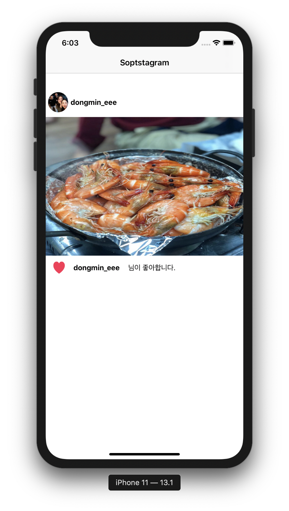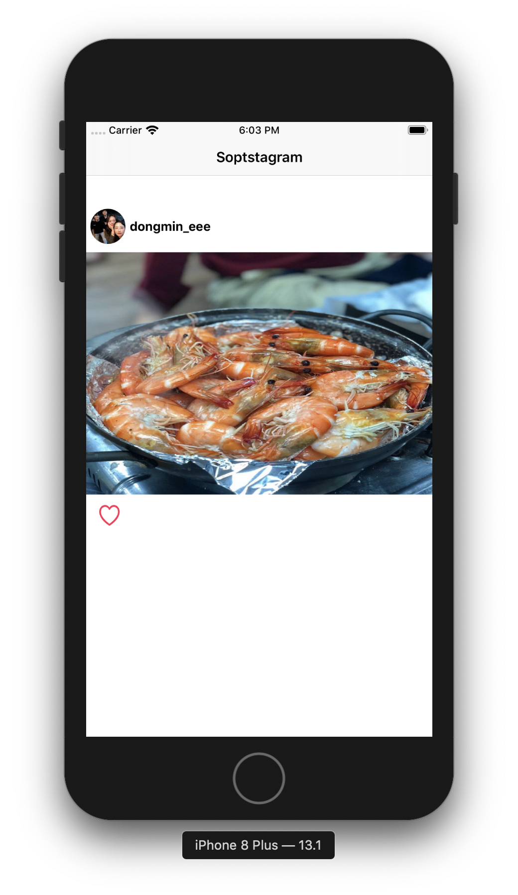


#### Second Week

1️⃣ Segue이용 데이터 전달

```swift
override func prepare(for segue: UIStoryboardSegue, sender: Any?) {
  // 다음화면의 identifier을 받아온다
  guard let identifier = segue.destination else { return }
  // identifier에 해당하는 ViewContoller 레퍼런스를 생성한다.
  if identifier == "purple" {
    guard let purple = segue.destination as? PurpleViewController else { return }
    purple.data = "보라색"
  } else {
    guard let green = segue.destination as? GreenViewController else { return }
    green.data = "녹색"
  }
}
```

**실행화면**

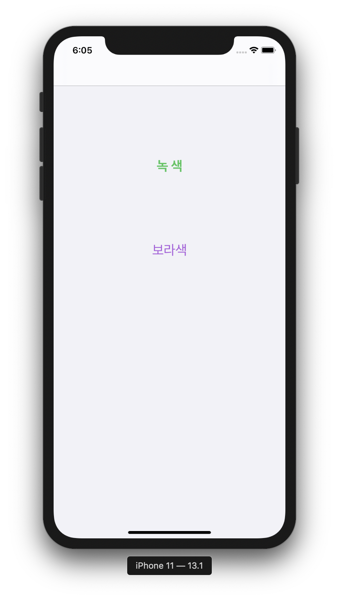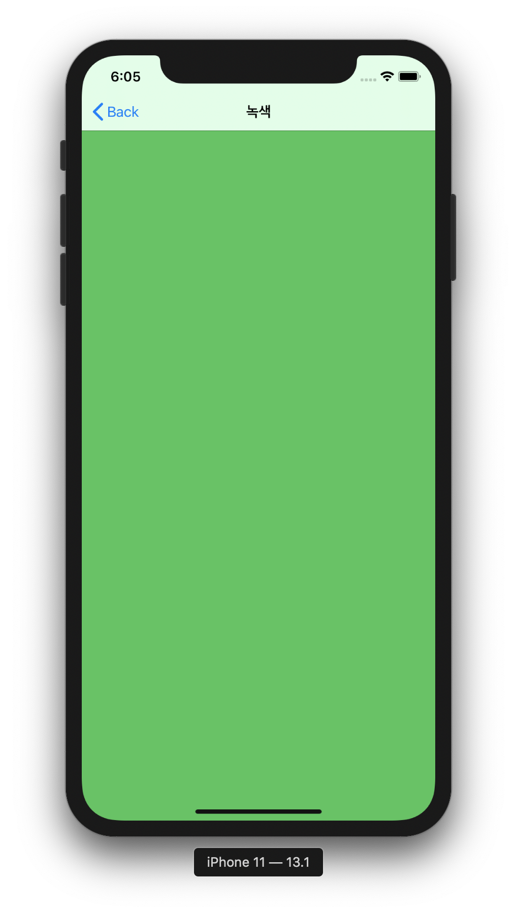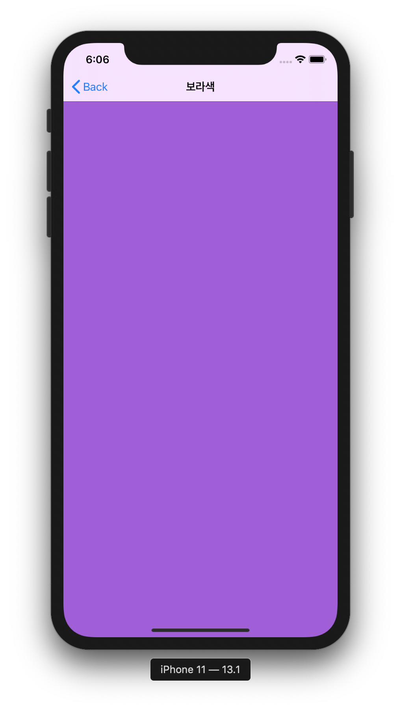


2️⃣ Segue이용 하지 않고 데이터 전달

```swift
guard let controller = self.storyboard?.instantiateViewController(identifier: "Recieve") as? RecieveViewController else { return } // instantiateViewController(identifier:) 메소드로 																						 "Recieve"을 Identifier로 가진 Controller 생성
controller.modalPresentationStyle = .fullScreen
controller.email = textField.text
controller.onOff = renewSwitch.isOn
controller.term = turmSwitch.value

self.present(controller, animated: true, completion: nil) // controller 화면으로 전환
```

**실행화면**

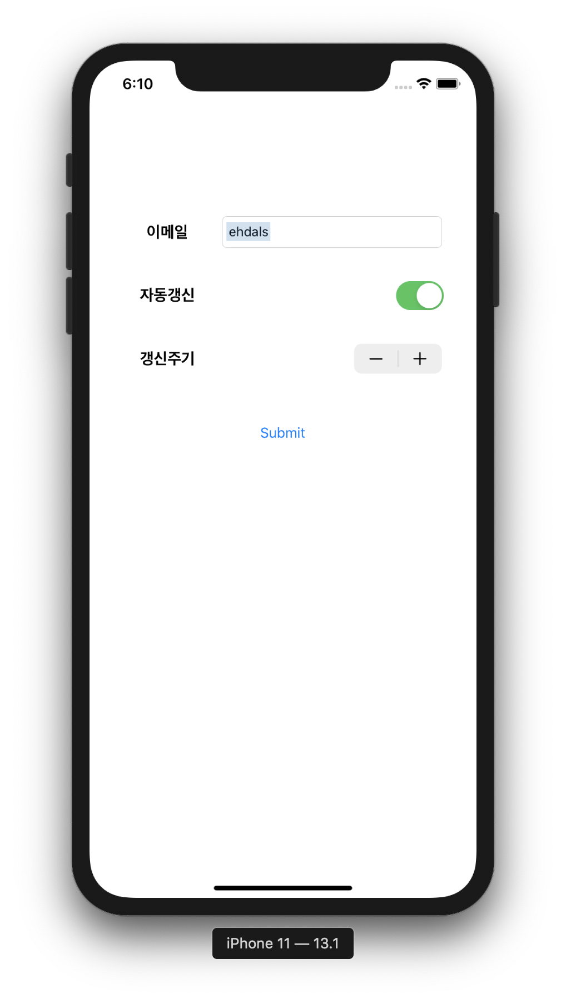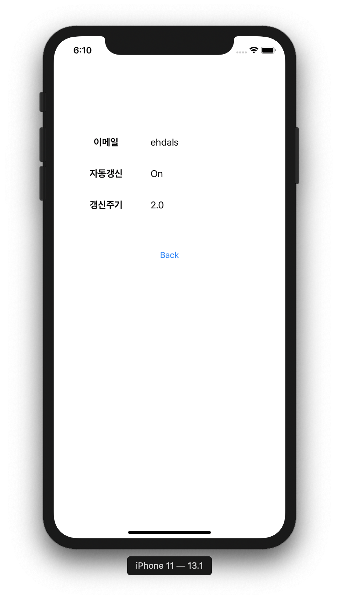


3️⃣ AutoLayOut이용 화면 구성

```swift
// 옵저버 패턴 활용 TextField 가리는 문제 해결
private func addKeyboardObserver() {
  // UIResponder.keyboardWillShowNotification에 해당하는 이벤트 발생 시 작동
  NotificationCenter.default.addObserver(self, selector: #selector(upKeyboard), name: UIResponder.keyboardWillShowNotification, object: nil)
  // UIResponder.keyboardDidHideNotification에 해당하는 이벤트 발생 시 작동
  NotificationCenter.default.addObserver(self, selector: #selector(downKeyboard), name: UIResponder.keyboardWillHideNotification, object: nil)
}

@objc func upKeyboard() {
  self.view.frame.origin.y = UtilValue.keyboardHeight
}

@objc func downKeyboard() {
  self.view.frame.origin.y = 0
}
```

**실행 화면**

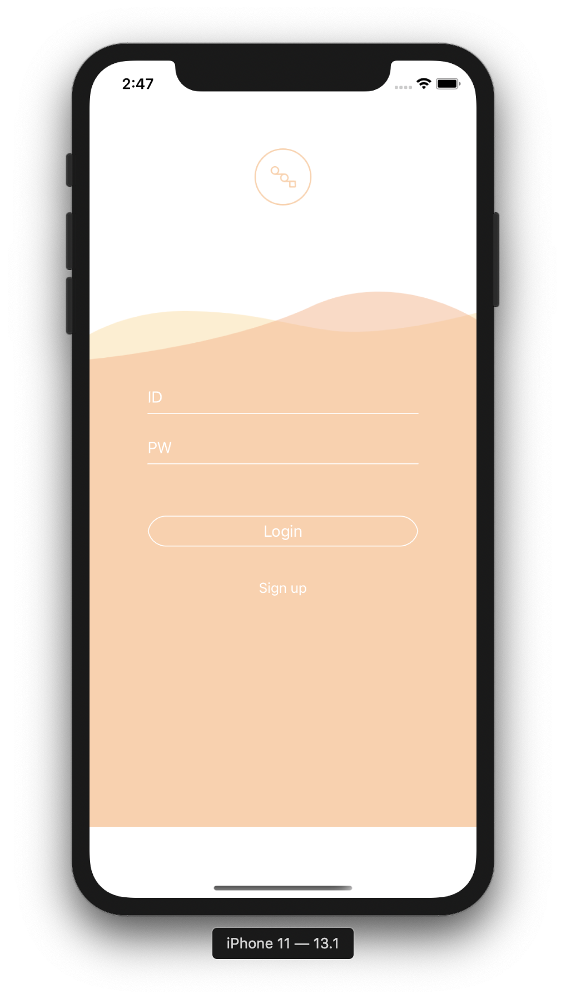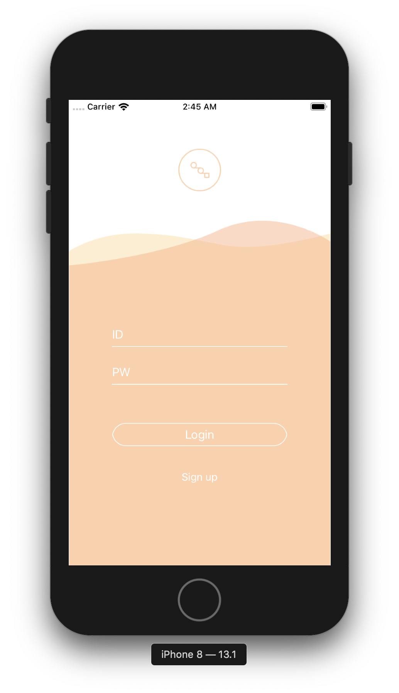


4️⃣ Calculator

* Custom View 만들어서 사용하기

```swift
class InputView: UIView {
  // Interface Builder를 이용하여 사용할 때, 호출되는 init
  override init(frame: CGRect) {
  	super.init(frame: frame)
    initailView()
  }
  
  // 코드를 통해 View를 만들 때, 호출되는 init
  required init?(coder aDecoder: NSCoder) {
    super.init(coder: aDecoder)
    initalView()
  }
  
  private func initailView() {
    // inputView 이름을 가진 class를 IB로 load해오는 코드
    guard let view = Bundle.main.loadNibNamed(NibNames.inputView, owner: self, options: nil)?.first as? UIView else { return }
    view.frame = self.bounds
    self.addSubview(view)
	}
}
```


**실행화면**

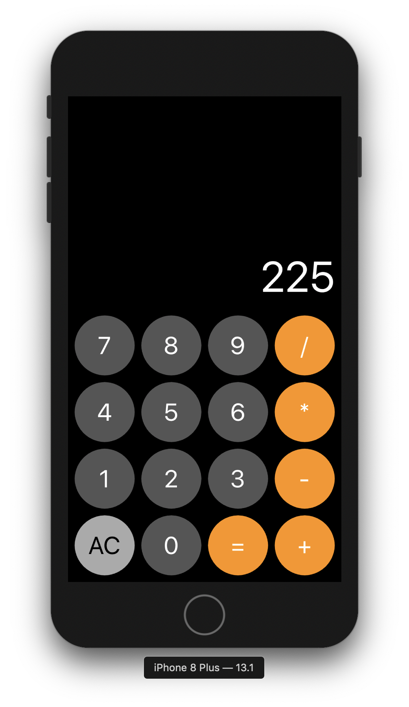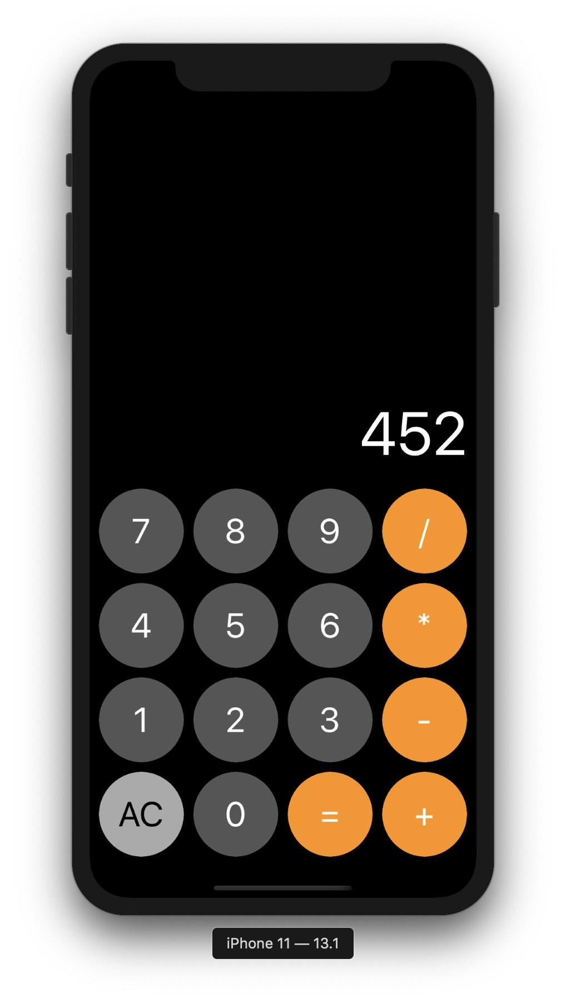


#### Third Week

1️⃣ `ScrollView`, `CollectionView` 활용 Main View 만들기

```swift
class MainViewController: UIViewController {
  @IBOutlet weak var bannerCollectionView: UICollectionView!
  
  override func viewDidLoad() {
    bannerCollectionView.dataSource = self 				// Cell의 Data 관련
    bannerCollectionView.delegate = self					// Cell의 크기, 이벤트등
  }
}

extension MainViewController: UICollectionViewDataSource {} //꼭 구현해야하는 기능 구현
extension MainViewController: UICollectionViewDelegate {}
```

**실행화면**

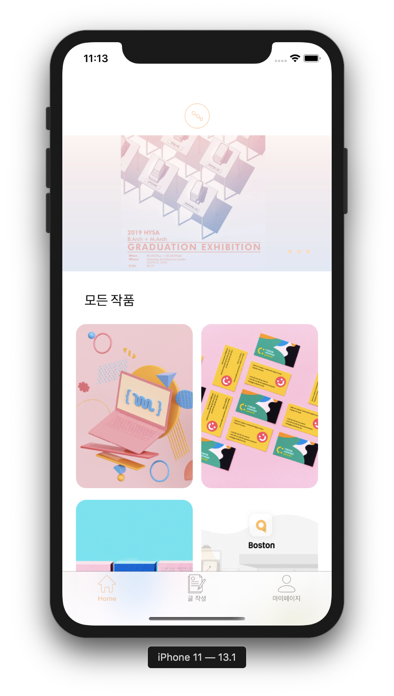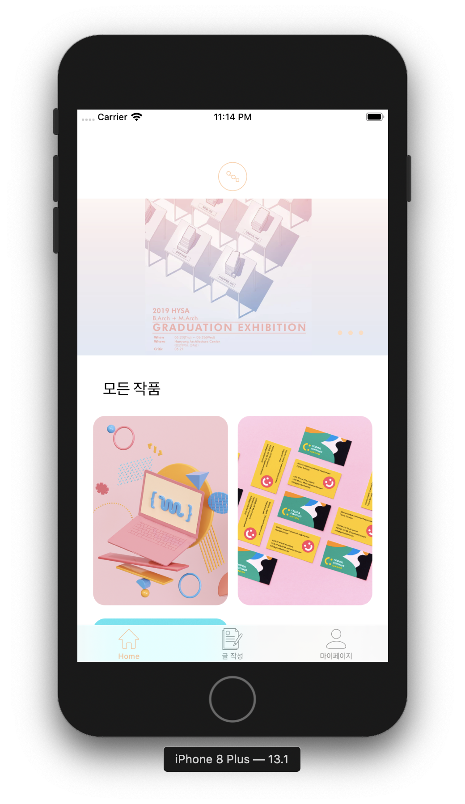


#### Fourth Week

1️⃣ `Alamorfire` 이용 서버 통신

> ✅ Login Service

**실행화면**

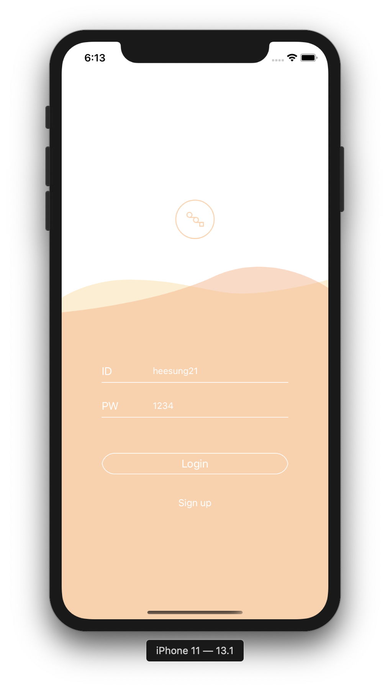


> ✅ Signup Service ( 다음과 같이 Signup 실행 )

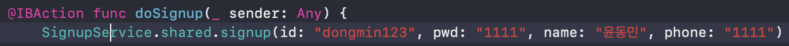

**실행화면**


