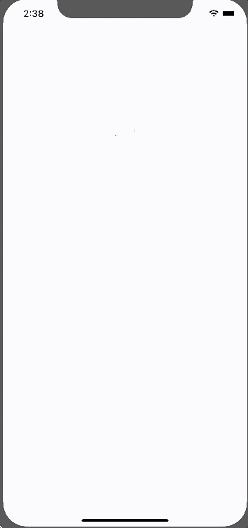
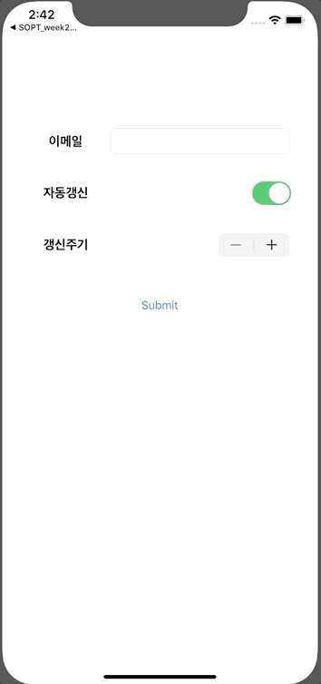

# YoonDongMin

#### FirstWeek

1. Soptstagram 화면 만들기

* **UI요소 둥글게 만들기**

```swift
@IBOutlet weak var profileImage: UIImageView!

profileImage.layer.cornerRadius = profileImage.frame.width * 0.5
profileImage.clipsToBounds = true   // true로 설정하게 되면 안의 내용들이 잘리게 된다. 즉, View를 기준으로 																				내용들이 나타난다.
profileImage.layer.masksToBounds = false // 위와 똑같은 내용
```

**실행화면**


####Second Week

1. Segue이용 데이터 전달

```swift
override func prepare(for segue: UIStoryboardSegue, sender: Any?) {
  // 다음화면의 identifier을 받아온다
  guard let identifier = segue.destination else { return }
  // identifier에 해당하는 ViewContoller 레퍼런스를 생성한다.
  if identifier == "purple" {
    guard let purple = segue.destination as? PurpleViewController else { return }
    purple.data = "보라색"
  } else {
    guard let green = segue.destination as? GreenViewController else { return }
    green.data = "녹색"
  }
}
```

**실행화면**




2. Segue이용 하지 않고 데이터 전달

```swift
guard let controller = self.storyboard?.instantiateViewController(identifier: "Recieve") as? RecieveViewController else { return } // instantiateViewController(identifier:) 메소드로 																						 "Recieve"을 Identifier로 가진 Controller 생성
controller.modalPresentationStyle = .fullScreen
controller.email = textField.text
controller.onOff = renewSwitch.isOn
controller.term = turmSwitch.value

self.present(controller, animated: true, completion: nil) // controller 화면으로 전환
```

**실행화면**




3. AutoLayOut이용 화면 구성

```swift
// 옵저버 패턴 활용 TextField 가리는 문제 해결
private func addKeyboardObserver() {
  // UIResponder.keyboardWillShowNotification에 해당하는 이벤트 발생 시 작동
  NotificationCenter.default.addObserver(self, selector: #selector(upKeyboard), name: UIResponder.keyboardWillShowNotification, object: nil)
  // UIResponder.keyboardDidHideNotification에 해당하는 이벤트 발생 시 작동
  NotificationCenter.default.addObserver(self, selector: #selector(downKeyboard), name: UIResponder.keyboardWillHideNotification, object: nil)
}

@objc func upKeyboard() {
  self.view.frame.origin.y = UtilValue.keyboardHeight
}

@objc func downKeyboard() {
  self.view.frame.origin.y = 0
}
```

**실행 화면**


