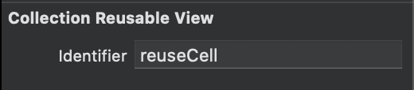
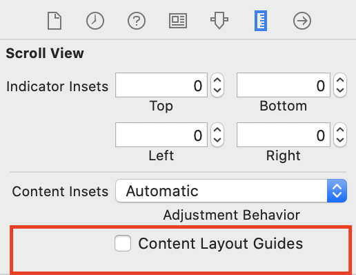
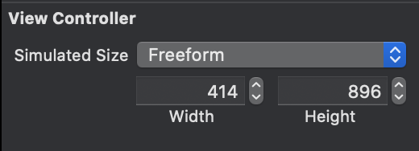
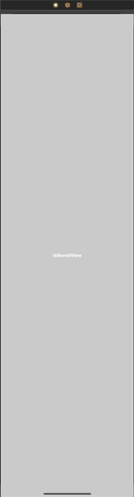
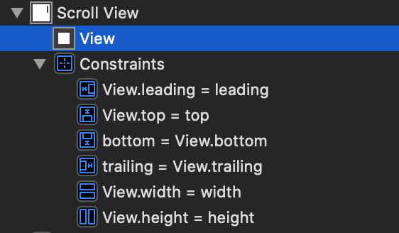
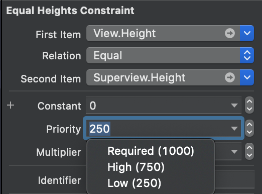
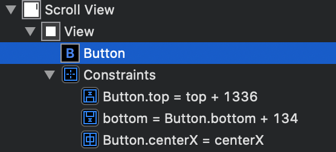
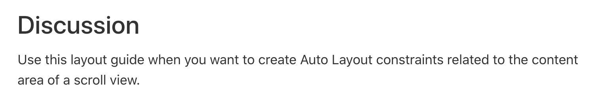
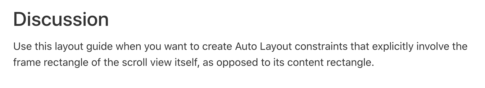

## 3주차 세미나


**Collection View 사용 Scroll**

 `UICollectionView`는 `UIScrollView`의 상속을 받고 있다. 즉 `UICollectionView`를 사용하여 Scroll이 가능하다.

* `Scroll Dirction`속성을 Horizontal, Vertical로 설정하여서 Scroll 방향 설정 가능하다.

 `UICollectionView`의 사용은 `UITableView` 의 사용과 유사하다. 우선 사용하기 위해 Cell의 `reuse Identifier` 을 지정해주어야 한다.

* `reuse Identifier`는 Cell의 재사용을 위해 사용된다. `CollectionView`가 스크롤링 되어서 한 Cell이 넘어간 경우 해당 `Identifier`의 Queue에서 Cell을 재사용하여 새로운 Cell을 설정한다. 즉, 메모리를 아낄 수 있다.




 `TableView`와 동일하게 `CollectionViewDataSource`와 `CollectionViewDelegate`등록 역시 필요하다. 

* `CollectionViewDataSource` : 보통 CollectionView에 들어갈 Content에 관한 내용들을 다루는 메소드들이 있다.
* `CollectionViewDelegate` : CollectionView에 터치를 하는 행동 등 CollectionView를 대신하여 일어날 이벤트들을 구현할 수 있다.

```swift
class ViewController: UIViewController {
  @IBOutlet weak var collectionView: UICollectionView!
  
  override func viewDidLoad() {
    super.viewDidLoad()
    collectionView.dataSource = self
    collectionView.delegate = self
  }
}

// CollectionView Content들의 직접적인 내용에 대한 설정을 할 수 있는 프로토콜
extension ViewController: UICollcetionViewDataSource {
  // 한 Section의 Cell의 개수를 설정
  // !!필수!!
	func collectionView(_ collectionView: UICollectionView, numberOfItemsInSection section: Int) -> Int {
    return 3
  }
  
  // CollectionView Cell을 IndexPath별로 생성하여 넣어주거나 Reuse Queue에서 사용
  // !!필수!!
  func collectionView(_ collectionView: UICollectionView, cellForItemAt indexPath: IndexPath) -> UICollectionViewCell {
    let cell = collectionView.dequeueReusableCell(withReuseIdentifier: "reuseCell", for: indexPath) // Identifier은 개인이 설정한 값
    return cell
  }
}

// CollectionView Content들의 Layout에 관련된 설정들을 할 수 있는 프로토콜
extension ViewController: UICollectionViewDelegateFlowLayout {
  // Cell의 IndexPath별로 크기 설정 가능
  func collectionView(_ collectionView: UICollectionView, layout collectionViewLayout: UICollectionViewLayout, sizeForItemAt indexPath: IndexPath) -> CGSize {
    return CGSize(width: collectionView.frame.width/2, height: collectionView.height/2)
  }
}
```


**Scroll View**

 **Xcode11**로 업데이트 되면서 2가지 사용법이 있다. 

 ✅ 이전 방법처럼 쓰기 위해서는 다음 그림과 같은 옵션을 꺼주어야 한다.



사용법

1️⃣ `ViewController` Simulated Size Freedom 으로 변경 (일단 View들을 나타내기 위해 사용 크기  를 이렇게 지정한다고 실제 View의 Height가 그 크기가 되지는 않는다.)



2️⃣ `ScrollView`을 생성하여 `ViewController`에 추가한다. 그리고 용도에 맞게 `Top`, `Trailing`, `Leading`, `Bottom`의 Constraints을 `Safe Area`또는 `Super View`에 맞춰 0으로 추가한다.

​                                                                        

3️⃣ Content View로 사용할 `UIView`을 `ScrollView`의 하위뷰로 추가한다. 그리고 Constraints을 `ScrollView`에 맞춰 `Top`, `Trailing`, `Leading`, `Bottom`을 0으로 추가한다. 추가적으로 Content View의 `Height`와 `Width`을 `ScrollView`에 맞게 설정한다.



4️⃣ 여기서 `Height`와 `Width`의 Constraint를 추가할 때, 만약 스크롤의 방향이 수평인 경우 `Width`를 수직인 경우는 `Height`의 Constraint의 Priority를 Low로 설정해주어야 한다. ==> ContentView의 크기가 Content에 따라 바뀔 수 있기 때문에 이렇게 설정하는 것이다.



5️⃣ 위의 단계까지만하면 ContentView의 크기를 정확히 모르기 때문에 스크롤이 되지 않을 것이다. 여기서 View의 요소들을 넣고 Constraints를 지정하여야 한다. 스크롤의 방향이 수직인 경우 UI 요소의 `Top`, `Bottom`을 설정해주어야 한다. 해당 Constraint를 통해 View의 `ContenSize`을 측정하고 스크롤이 가능하게 된다.




 ✅ 바뀐 방법을 사용하기 위해선 옵션을 해제하지 않고 사용하면 된다. ==> 이 부분에 대해서는 공부 필요함

* Content Layout Guide : `ScrollView`의 Content 부분에 관련된 AutoLayout을 적용할 때, 사용할 수 있다.



* Frame Layout Guide : `ScrollView`의 바깥 테두리의 AutoLayout을 적용하는데 사용할 수 있다.


